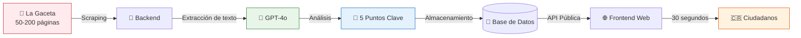
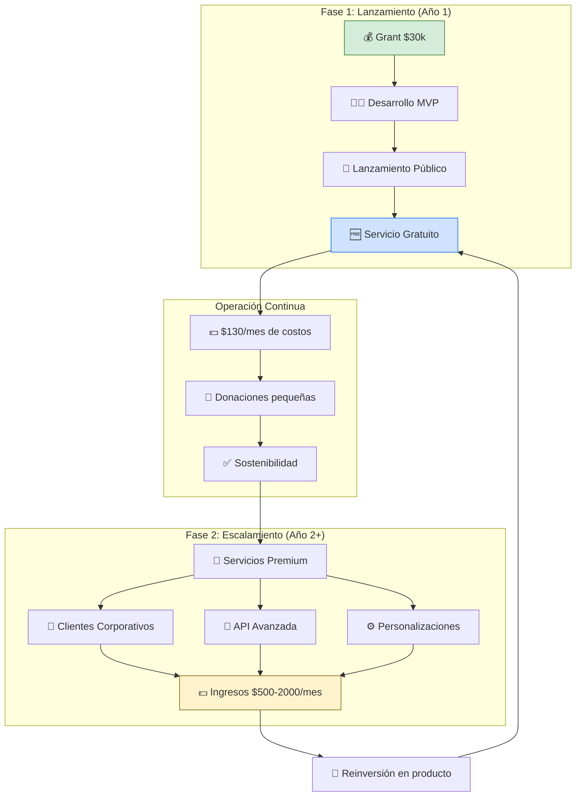

# GacetaChat - Dossier para ONGs y Organizaciones
## Infraestructura Democrática para la Sociedad Civil

**Versión**: 3.0 (Actualizado con recomendaciones de experta en ONGs - MIT)
**Fecha**: Noviembre 2025
**Contacto**: [GitHub](https://github.com/GSejas/gacetachat)

---

## 🎯 Resumen Ejecutivo

**GacetaChat es infraestructura democrática pública**, diseñada específicamente para empoderar a las organizaciones de la sociedad civil costarricense.

**El Problema Real**: La Gaceta Oficial publica 50-200 páginas diarias de leyes, decretos y regulaciones. Corporaciones y lobbyistas la monitorean constantemente, creando **asimetría de información** que debilita a las ONGs y a la democracia.

**Nuestra Solución**: GacetaChat usa IA para leer La Gaceta cada día y generar resúmenes accionables. No es una app - es **infraestructura pública** para la defensoría y transparencia.

**Teoría de Cambio**: ONGs empoderadas → Medios/Defensoría activa → Ciudadanía informada → Democracia fortalecida

---

## 📊 Impacto Esperado

### Usuarios Prioritarios (En Orden Estratégico)

#### Tier 1: ONGs Ambientales 🌱
**Por qué primero**: Las regulaciones ambientales cambian constantemente vía La Gaceta. Estas organizaciones NECESITAN este servicio.

**Ejemplos**: FECON, Costa Rica Limpia, APREFLOFAS, grupos conservacionistas locales

**Casos de uso**:
- Alertas automáticas cuando aparecen: "SINAC", "MINAE", "bosque", "contaminación"
- Monitoreo de permisos ambientales y concesiones
- Análisis histórico de tendencias en políticas ambientales

#### Tier 2: ONGs de Transparencia y Anti-corrupción ⚖️
**Por qué segundo**: Tienen financiamiento, conexiones mediáticas y voluntad política.

**Ejemplos**: Transparency International CR, Ojo al Voto, organizaciones de vigilancia ciudadana

**Casos de uso**:
- Rastreo de contratos gubernamentales
- Monitoreo de nombramientos políticos
- Detección de anomalías en licitaciones

#### Tier 3: ONGs de Derechos Laborales y Justicia Social 👷
**Ejemplos**: Sindicatos, organizaciones de derechos de mujeres, grupos indígenas, defensorías de personas con discapacidad

**Casos de uso**:
- Cambios en leyes laborales
- Decisiones de la CCSS
- Anuncios de salario mínimo
- Contrataciones del sector público

#### Usuarios Secundarios
4. **Periodistas** - Amplifican hallazgos de ONGs a la ciudadanía
5. **Instituciones Académicas** - Investigación sobre políticas públicas
6. **Ciudadanía General** - Beneficiarios finales de la transparencia

### Métricas de Éxito (Año 1)

**Métricas de Adopción Organizacional (Primarias)**:
- 10+ ONGs usando GacetaChat diariamente
- 5+ organizaciones pagando suscripción premium
- 50+ historias mediáticas citando datos de GacetaChat
- 20+ casos documentados de defensoría informada por GacetaChat

**Métricas de Impacto Democrático (Secundarias)**:
- Aumento en comentarios públicos sobre regulaciones
- Reducción en tiempo de respuesta de ONGs a políticas
- Incremento en detección temprana de problemas de gobernanza
- Correlación con aumento en rendición de cuentas gubernamental

---

## 💡 Cómo Funciona

### Proceso Automático Diario



**Ejemplo:**

```
1. Scraping → Descarga La Gaceta del sitio oficial
2. Procesamiento → IA (GPT-4) analiza el contenido
3. Resumen → Genera 5 puntos clave en español claro
4. Publicación → Disponible en web y API pública
```

### Ejemplo de Resumen

**La Gaceta - 15 de enero, 2025**

⚖️ Nueva ley de impuestos: Tasa de IVA aumenta del 13% al 13.5%
🏥 Reforma sanitaria: Nuevos requisitos para permisos de alimentos
🎓 Educación: Cambios en calendario escolar para 2025
💰 Presupuesto: Aumenta inversión en infraestructura vial
🌳 Ambiente: Nuevas regulaciones para protección de bosques

---

## 🏗️ Arquitectura Técnica

### Stack Tecnológico
- **Frontend**: Next.js 14 (React) - Interfaz moderna y rápida
- **Backend**: FastAPI (Python) - API RESTful escalable
- **Base de Datos**: PostgreSQL - Almacenamiento confiable
- **IA**: OpenAI GPT-4o - Generación de resúmenes
- **Hosting**: Vercel + Railway - Infraestructura cloud

### Características Principales
- ✅ Resúmenes diarios automáticos
- ✅ Archivo histórico de 90 días
- ✅ Búsqueda por palabras clave
- ✅ API pública gratuita
- ✅ 100% código abierto (MIT License)

---

## 💰 Presupuesto y Sostenibilidad

### Inversión Inicial (Una vez)
| Concepto | Costo |
|----------|-------|
| Desarrollo (4 semanas) | $20,000 |
| Diseño UX/UI | $3,000 |
| DevOps y configuración | $2,000 |
| Pruebas y seguridad | $3,000 |
| Herramientas IA (Claude Code Plus) | $100 |
| Contingencias | $1,900 |
| **TOTAL** | **$30,000** |

### Costos Operativos (Anuales)
| Concepto | Costo Mensual | Costo Anual |
|----------|---------------|-------------|
| Hosting cloud | $80 | $960 |
| API de OpenAI | $50 | $600 |
| **TOTAL** | **$130** | **$1,560** |

### Modelo de Sostenibilidad



1. **Financiamiento inicial**: Grants/fondos de fundaciones
2. **Operación**: Costos mínimos ($130/mes)
3. **Ingresos futuros** (Fase 2+):
   - Servicios premium para empresas
   - API con límites más altos
   - Personalización para organizaciones
   - Soporte técnico dedicado

**Objetivo**: Mantenerse gratis para ciudadanos, sostenible con servicios corporativos.

---

## 📅 Timeline de Desarrollo

### Fase 1: MVP (4 semanas) - **AI-Accelerated**
- **Semana 1**: Backend + Base de datos + Scraper
- **Semana 2**: Integración con GPT-4 + Resúmenes
- **Semana 3**: Frontend + Interfaz de usuario
- **Semana 4**: Testing + Lanzamiento público

### Fase 2: Crecimiento (3-6 meses)
- Optimización de rendimiento
- App móvil (iOS/Android)
- Notificaciones por email
- Búsqueda avanzada con filtros

### Fase 3: Expansión (6-12 meses)
- Toolkit de replicación para otros países
- Traducción automática al inglés
- Análisis de tendencias con IA
- Integración con medios de comunicación

---

## 🌟 Propuesta de Valor para ONGs

### Acceso a Información
- Monitoreo automático de políticas públicas
- Alertas sobre temas de su interés
- Datos históricos para investigación

### Transparencia
- Todo el código es público (GitHub)
- Sin costos ocultos
- Datos accesibles vía API

### Colaboración
- Sugerencias de mejoras bienvenidas
- Posibilidad de contribuir al desarrollo
- Integración con sus sistemas

### Capacitación
- Documentación completa
- Ejemplos de uso de la API
- Soporte de la comunidad

---

## 📈 Métricas de Éxito (Año 1)

### Uso
- ✅ 10,000 usuarios mensuales activos
- ✅ 300,000 resúmenes leídos
- ✅ 99.5% uptime (disponibilidad)

### Impacto Social
- ✅ 50+ citas en medios de comunicación
- ✅ 10+ integraciones con organizaciones
- ✅ 3+ réplicas en otros países

### Técnico
- ✅ 100% código abierto
- ✅ < 3 segundos de carga
- ✅ API pública funcional

---

## 🤝 Oportunidades de Colaboración

### Para ONGs
1. **Uso de la herramienta** - Integrar GacetaChat en sus workflows
2. **Feedback** - Sugerencias de mejoras y nuevas funcionalidades
3. **Difusión** - Compartir con sus redes y beneficiarios
4. **Co-financiamiento** - Participar en rondas de fondos

### Para Fundaciones
1. **Financiamiento** - Grant de $30,000 para desarrollo inicial
2. **Mentorship** - Guía estratégica y de impacto social
3. **Conexiones** - Introducción a otras organizaciones

### Para Empresas Sociales
1. **Patrocinio** - Apoyo para costos operativos
2. **Servicios premium** - Versión personalizada para su organización
3. **Alianzas** - Integración con sus productos

---

## 🚀 Estado Actual

### Completado ✅
- [x] Prototipo V1 (funcional pero complejo)
- [x] Arquitectura V2 diseñada
- [x] Presupuesto detallado
- [x] Plan de implementación de 4 semanas
- [x] Estrategia de sostenibilidad
- [x] Documentación técnica completa

### En Proceso 🔄
- [ ] Búsqueda de financiamiento ($30,000)
- [ ] Repositorio público en GitHub
- [ ] Demo funcional mejorado

### Próximos Pasos 📋
1. Asegurar financiamiento inicial
2. Contratar desarrollador full-stack
3. Desarrollo acelerado con IA (4 semanas)
4. Lanzamiento público MVP
5. Captación de primeros 1,000 usuarios

---

## 💼 Equipo y Gobernanza

### Equipo Actual
- **Desarrollador Principal**: Jorge Sequeira
- **Rol**: Arquitecto de software, desarrollo full-stack
- **GitHub**: [@GSejas](https://github.com/GSejas)

### Modelo de Gobernanza
- **Código abierto**: Licencia MIT (libre uso y modificación)
- **Decisiones**: Basadas en feedback de la comunidad
- **Transparencia**: Roadmap público, issues en GitHub
- **Inclusión**: Pull requests bienvenidos

### Advisors Buscados
- Experto en transparencia gubernamental
- Especialista en UX para ONGs
- Abogado con conocimiento de La Gaceta
- Representante de medios de comunicación

---

## 📞 Contacto e Información

### Proyecto
- **Sitio web**: https://gsejas.github.io/gacetachat
- **GitHub**: https://github.com/GSejas/gacetachat
- **Demo**: Disponible para ejecutar localmente

### Documentación
- **Plan de Implementación**: [IMPLEMENTATION_PLAN.md](IMPLEMENTATION_PLAN.md)
- **Estrategia de Fondos**: [GRANT_STRATEGY.md](docs/GRANT_STRATEGY.md)
- **Arquitectura Técnica**: [ARCHITECTURAL_OVERHAUL.md](docs/ARCHITECTURAL_OVERHAUL.md)
- **Changelog**: [CHANGELOG.md](CHANGELOG.md)

### Para Consultas
- **Organizaciones**: Abrir issue en GitHub o contactar vía email
- **Prensa**: Información disponible en README.md
- **Inversión social**: Ver GRANT_STRATEGY.md

---

## 🇨🇷 Compromiso con Costa Rica

GacetaChat es:
- **Hecho en Costa Rica** - Desarrollado por y para costarricenses
- **Para el pueblo** - Gratis y accesible para todos
- **De código abierto** - Cualquiera puede verificar y mejorar el código
- **Sostenible** - Diseñado para operar con costos mínimos
- **Replicable** - Puede adaptarse a otros países de América Latina

### Valores
✅ **Transparencia** - Todo es público y auditable
✅ **Accesibilidad** - Lenguaje simple, sin tecnicismos
✅ **Inclusión** - Para todos los costarricenses
✅ **Sostenibilidad** - Costos bajos, impacto alto
✅ **Innovación** - IA al servicio del bien común

---

## 📖 Licencia y Uso

**Licencia**: MIT License (código completamente abierto)

**Esto significa que usted puede**:
- ✅ Usar el software comercialmente
- ✅ Modificar el código fuente
- ✅ Distribuir copias
- ✅ Sublicenciar
- ✅ Uso privado

**Sin restricciones**, solo se requiere:
- Incluir aviso de copyright
- Incluir licencia MIT en distribuciones

---

## 💪 ¿Por Qué Ahora?

### Momentum Tecnológico
- IA generativa (GPT-4) alcanzó madurez en 2024
- Herramientas de desarrollo acelerado (Claude Code Plus)
- Cloud computing es accesible y económico

### Necesidad Social
- Ciudadanía más educada y exigente
- Desconfianza en instituciones requiere transparencia
- Acceso a información como derecho fundamental

### Costo-Beneficio
- **$30k** desarrollar vs **$150k+** métodos tradicionales
- **4 semanas** vs **6+ meses** tiempo tradicional
- **$130/mes** operar - sostenible con donaciones mínimas

### Replicabilidad Regional
- Modelo aplicable a toda Centroamérica
- Potencial de impactar 50M+ personas
- Oportunidad de liderazgo regional en GovTech

---

**"La democracia muere en la oscuridad. GacetaChat enciende la luz."**

---

*Para más información o para participar en este proyecto, visite [nuestro repositorio en GitHub](https://github.com/GSejas/gacetachat) o abra un issue con sus preguntas.*

**Hecho con ❤️ en Costa Rica para el mundo** 🇨🇷
