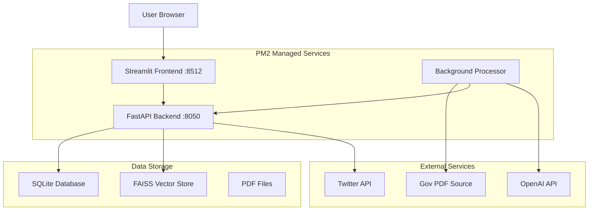
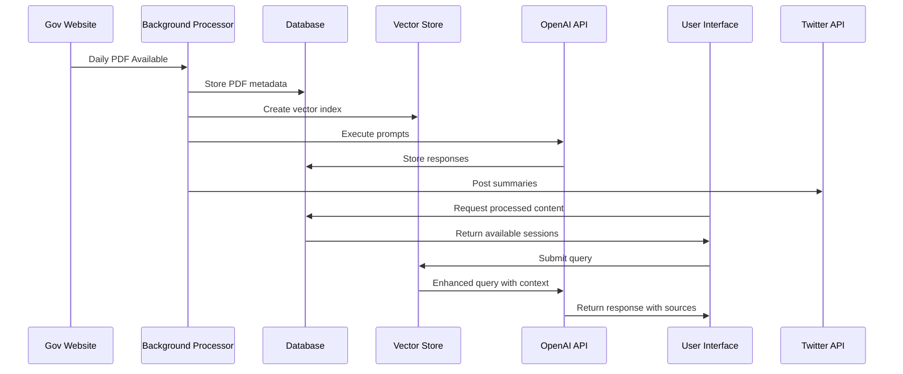

# Architecture Documentation

## 🏗️ System Architecture Overview

GacetaChat is built on a microservices architecture with three main components orchestrated by PM2, designed for reliability, scalability, and maintainability.



## 🎯 Design Principles
| **Separation of Concerns** | **Event-Driven Architecture** | **Scalability Considerations** |
|----------------------------|-------------------------------|-------------------------------|
| **Frontend**: User interface and experience | **Document Processing**: Triggered by schedule or manual request | **Horizontal Scaling**: Multiple instances via PM2 |
| **Backend**: Business logic and API | **AI Analysis**: Executed on document availability | **Vertical Scaling**: Resource allocation per service |
| **Processor**: Document processing and AI analysis | **User Interactions**: Real-time chat processing | **Caching**: Redis for frequently accessed data |
| **Database**: Data persistence and state management | **Social Media**: Automated posting based on content analysis | **Load Distribution**: Nginx reverse proxy |

## 🔧 Component Architecture

### Frontend Layer (Streamlit)

```python
# Application Structure
streamlit_app.py                 # Main entry point
├── mpages/
│   ├── 1_Home.py               # Dashboard and content view
│   ├── 2_Twitter.py            # Social media integration
│   └── 3_Admin.py              # Administrative functions
├── components/
│   ├── chat_interface.py       # Chat functionality
│   ├── pdf_viewer.py           # Document viewer
│   └── prompt_manager.py       # Prompt configuration
└── utils/
    ├── session_manager.py      # Session state handling
    └── ui_helpers.py           # UI utility functions
```

**Key Features**:
- Multi-page application with navigation
- Real-time chat interface
- PDF document viewer
- Interactive prompt management
- Session state management

### Backend Layer (FastAPI)

```python
# API Structure
fastapp.py                      # Main FastAPI application
├── routes/
│   ├── execution.py           # Document processing endpoints
│   ├── chat.py                # Chat and query endpoints
│   ├── admin.py               # Administrative endpoints
│   └── twitter.py             # Social media endpoints
├── services/
│   ├── pdf_service.py         # PDF processing logic
│   ├── ai_service.py          # AI model interactions
│   ├── twitter_service.py     # Twitter integration
│   └── auth_service.py        # Authentication logic
├── middleware/
│   ├── rate_limiter.py        # Rate limiting
│   ├── auth_middleware.py     # Authentication
│   └── cors_middleware.py     # Cross-origin requests
└── schemas/
    ├── execution_schemas.py    # Request/response models
    ├── chat_schemas.py         # Chat data models
    └── user_schemas.py         # User data models
```

**Key Features**:
- RESTful API design
- Request/response validation
- Authentication and authorization
- Rate limiting and security
- OpenAPI documentation

### Processing Layer (Background Services)

```python
# Background Processing
download_gaceta.py              # Main processor
├── schedulers/
│   ├── pdf_scheduler.py       # PDF download scheduling
│   ├── ai_scheduler.py        # AI processing scheduling
│   └── twitter_scheduler.py   # Social media scheduling
├── processors/
│   ├── pdf_processor.py       # PDF text extraction
│   ├── faiss_helper.py        # Vector indexing
│   ├── prompt_engine.py       # AI prompt execution
│   └── content_generator.py   # Content creation
├── integrations/
│   ├── gov_scraper.py         # Government website scraping
│   ├── openai_client.py       # OpenAI API client
│   └── twitter_client.py      # Twitter API client
└── utils/
    ├── file_manager.py         # File operations
    ├── error_handler.py        # Error management
    └── logger.py               # Logging utilities
```

**Key Features**:
- Scheduled document processing
- AI-powered content analysis
- Social media automation
- Error handling and recovery
- Comprehensive logging

## 📊 Data Architecture

### Database Schema

```sql
-- Core Entities
CREATE TABLE users (
    id INTEGER PRIMARY KEY,
    email VARCHAR UNIQUE,
    name VARCHAR,
    language VARCHAR DEFAULT 'en',
    created_at TIMESTAMP DEFAULT CURRENT_TIMESTAMP
);

CREATE TABLE gaceta_pdfs (
    id INTEGER PRIMARY KEY,
    date DATE UNIQUE,
    file_path VARCHAR,
    status VARCHAR DEFAULT 'pending',
    created_at TIMESTAMP DEFAULT CURRENT_TIMESTAMP
);

CREATE TABLE execution_sessions (
    id INTEGER PRIMARY KEY,
    document_id INTEGER REFERENCES gaceta_pdfs(id),
    user_id INTEGER REFERENCES users(id),
    status VARCHAR DEFAULT 'init',
    is_approved BOOLEAN DEFAULT FALSE,
    created_at TIMESTAMP DEFAULT CURRENT_TIMESTAMP
);

CREATE TABLE prompts (
    id INTEGER PRIMARY KEY,
    name VARCHAR,
    prompt_text TEXT,
    short_description TEXT,
    alias VARCHAR UNIQUE,
    scheduled_execution BOOLEAN DEFAULT TRUE,
    doc_aware BOOLEAN DEFAULT TRUE,
    created_at TIMESTAMP DEFAULT CURRENT_TIMESTAMP
);

CREATE TABLE content_execution_logs (
    id INTEGER PRIMARY KEY,
    execution_session_id INTEGER REFERENCES execution_sessions(id),
    prompt_id INTEGER REFERENCES prompts(id),
    query_response_id INTEGER REFERENCES prompt_query_responses(id),
    state VARCHAR DEFAULT 'pending',
    created_at TIMESTAMP DEFAULT CURRENT_TIMESTAMP
);

CREATE TABLE prompt_query_responses (
    id INTEGER PRIMARY KEY,
    response TEXT,
    sources TEXT,
    raw_prompt TEXT,
    created_at TIMESTAMP DEFAULT CURRENT_TIMESTAMP
);

-- Chat System
CREATE TABLE chat_messages (
    id INTEGER PRIMARY KEY,
    session_id INTEGER REFERENCES execution_sessions(id),
    role VARCHAR CHECK (role IN ('user', 'assistant')),
    content TEXT,
    created_at TIMESTAMP DEFAULT CURRENT_TIMESTAMP
);

-- Social Media
CREATE TABLE twitter_users (
    id INTEGER PRIMARY KEY,
    twitter_id VARCHAR UNIQUE,
    username VARCHAR,
    access_token VARCHAR,
    access_token_secret VARCHAR,
    created_at TIMESTAMP DEFAULT CURRENT_TIMESTAMP
);

-- Usage Tracking
CREATE TABLE global_query_counts (
    id INTEGER PRIMARY KEY,
    date DATE UNIQUE,
    count INTEGER DEFAULT 0,
    created_at TIMESTAMP DEFAULT CURRENT_TIMESTAMP
);
```

### Data Flow



## 🔐 Security Architecture

### Authentication Flow

```python
# API Key Authentication
class APIKeyAuth:
    def __init__(self, api_key: str):
        self.api_key = api_key
    
    def verify_request(self, request_api_key: str) -> bool:
        return request_api_key == self.api_key

# Session Management
class SessionManager:
    def __init__(self, redis_client):
        self.redis = redis_client
    
    def create_session(self, user_id: int) -> str:
        session_id = str(uuid.uuid4())
        self.redis.setex(f"session:{session_id}", 3600, user_id)
        return session_id
    
    def validate_session(self, session_id: str) -> Optional[int]:
        return self.redis.get(f"session:{session_id}")
```

### Security Measures

1. **API Security**:
   - API key authentication
   - Rate limiting per endpoint
   - Input validation and sanitization
   - CORS configuration

2. **Data Security**:
   - Database connection encryption
   - Sensitive data hashing
   - Secure file storage
   - Environment variable management

3. **External API Security**:
   - OAuth 2.0 for Twitter
   - API key rotation
   - Request signing
   - Error message sanitization

## 🚀 Deployment Architecture

### PM2 Configuration

```javascript
// ecosystem.config.js
module.exports = {
  apps: [
    {
      name: 'gaceta-frontend',
      script: 'streamlit',
      args: 'run app.py --server.port 8512',
      interpreter: 'python',
      instances: 1,
      exec_mode: 'fork',
      env: {
        ENVIRONMENT: 'production'
      }
    },
    {
      name: 'gaceta-backend',
      script: 'uvicorn',
      args: 'fastapp:app --host 0.0.0.0 --port 8050',
      interpreter: 'python',
      instances: 2,
      exec_mode: 'cluster',
      env: {
        ENVIRONMENT: 'production'
      }
    },
    {
      name: 'gaceta-processor',
      script: 'download_gaceta.py',
      interpreter: 'python',
      instances: 1,
      exec_mode: 'fork',
      cron_restart: '0 6 * * *'  // Restart daily at 6 AM
    }
  ]
};
```

### Infrastructure Components

```yaml
# docker-compose.yml
version: '3.8'
services:
  nginx:
    image: nginx:alpine
    ports:
      - "80:80"
      - "443:443"
    volumes:
      - ./nginx.conf:/etc/nginx/nginx.conf
      - ./ssl:/etc/nginx/ssl
    depends_on:
      - frontend
      - backend
  
  frontend:
    build:
      context: .
      dockerfile: Dockerfile.frontend
    ports:
      - "8512:8512"
    depends_on:
      - backend
  
  backend:
    build:
      context: .
      dockerfile: Dockerfile.backend
    ports:
      - "8050:8050"
    depends_on:
      - database
      - redis
  
  processor:
    build:
      context: .
      dockerfile: Dockerfile.processor
    depends_on:
      - database
      - redis
  
  database:
    image: postgres:13
    environment:
      POSTGRES_DB: gaceta
      POSTGRES_USER: gaceta_user
      POSTGRES_PASSWORD: ${DB_PASSWORD}
    volumes:
      - postgres_data:/var/lib/postgresql/data
  
  redis:
    image: redis:6-alpine
    ports:
      - "6379:6379"
    volumes:
      - redis_data:/data

volumes:
  postgres_data:
  redis_data:
```

## 📈 Performance Architecture

### Caching Strategy

```python
# Multi-level caching
class CacheManager:
    def __init__(self):
        self.memory_cache = {}  # In-memory cache
        self.redis_cache = redis.Redis()  # Distributed cache
        self.db_cache = {}  # Database query cache
    
    def get(self, key: str, cache_type: str = 'memory'):
        if cache_type == 'memory':
            return self.memory_cache.get(key)
        elif cache_type == 'redis':
            return self.redis_cache.get(key)
        elif cache_type == 'db':
            return self.db_cache.get(key)
    
    def set(self, key: str, value: Any, ttl: int = 3600):
        # Set in multiple cache layers
        self.memory_cache[key] = value
        self.redis_cache.setex(key, ttl, pickle.dumps(value))
```

### Database Optimization

```python
# Database connection pooling
engine = create_engine(
    DATABASE_URL,
    pool_size=20,
    max_overflow=30,
    pool_timeout=30,
    pool_recycle=1800,
    pool_pre_ping=True
)

# Query optimization
class OptimizedRepository:
    def get_execution_sessions_with_logs(self, date: str):
        return session.query(ExecutionSession)\
            .options(
                joinedload(ExecutionSession.logs),
                joinedload(ExecutionSession.document)
            )\
            .filter(ExecutionSession.date == date)\
            .all()
```

### AI Model Optimization

```python
# Model selection based on query complexity
class ModelOptimizer:
    def select_model(self, query: str, context_size: int):
        if context_size < 1000:
            return "gpt-3.5-turbo"
        elif context_size < 4000:
            return "gpt-4o-mini"
        else:
            return "gpt-4o"
    
    def optimize_prompt(self, prompt: str, max_tokens: int):
        # Truncate prompt if too long
        if len(prompt) > max_tokens:
            return prompt[:max_tokens] + "..."
        return prompt
```

## 🔄 Integration Architecture

### External Service Integration

```python
# Service registry pattern
class ServiceRegistry:
    def __init__(self):
        self.services = {
            'openai': OpenAIService(),
            'twitter': TwitterService(),
            'pdf_scraper': PDFScraperService(),
            'email': EmailService()
        }
    
    def get_service(self, service_name: str):
        return self.services.get(service_name)
    
    def register_service(self, name: str, service: Any):
        self.services[name] = service

# Circuit breaker pattern
class CircuitBreaker:
    def __init__(self, failure_threshold: int = 5, timeout: int = 60):
        self.failure_threshold = failure_threshold
        self.timeout = timeout
        self.failure_count = 0
        self.last_failure_time = None
        self.state = 'closed'  # closed, open, half-open
    
    def call(self, func, *args, **kwargs):
        if self.state == 'open':
            if time.time() - self.last_failure_time > self.timeout:
                self.state = 'half-open'
            else:
                raise CircuitBreakerError("Circuit breaker is open")
        
        try:
            result = func(*args, **kwargs)
            self.on_success()
            return result
        except Exception as e:
            self.on_failure()
            raise e
```

## 🎯 Scalability Patterns

### Horizontal Scaling

```python
# Load balancer configuration
class LoadBalancer:
    def __init__(self, instances: List[str]):
        self.instances = instances
        self.current = 0
    
    def get_next_instance(self) -> str:
        instance = self.instances[self.current]
        self.current = (self.current + 1) % len(self.instances)
        return instance

# Auto-scaling trigger
class AutoScaler:
    def __init__(self, min_instances: int = 1, max_instances: int = 10):
        self.min_instances = min_instances
        self.max_instances = max_instances
    
    def should_scale_up(self, metrics: dict) -> bool:
        return (metrics['cpu_usage'] > 80 or 
                metrics['memory_usage'] > 80 or 
                metrics['response_time'] > 5000)
    
    def should_scale_down(self, metrics: dict) -> bool:
        return (metrics['cpu_usage'] < 30 and 
                metrics['memory_usage'] < 30 and 
                metrics['response_time'] < 1000)
```

This architecture documentation provides a comprehensive overview of the system design, enabling developers to understand, maintain, and extend the GacetaChat platform effectively.
