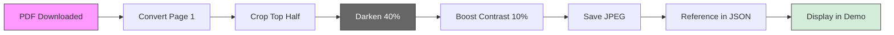

# Header Images Feature

## Visual Design Decision

Each day's summary now displays a **darkened header image** extracted from the actual La Gaceta PDF. This design choice adds:

1. **Authenticity** - Shows the real government document
2. **Trust** - "This is not fake news, this is the official gazette"
3. **Visual distinction** - Each day looks different
4. **Professional aesthetic** - Watermark/background effect

## Implementation

### How It Works



### Processing Steps

1. **Extract:** First page from PDF (pdf2image at 150 DPI)
2. **Crop:** Top 50% (header area with title, date, etc.)
3. **Darken:** Reduce brightness to 60% (ImageEnhance.Brightness)
4. **Contrast:** Boost to 110% (slight enhancement)
5. **Optimize:** Save as JPEG quality 85
6. **Store:** `data/header_images/YYYY-MM-DD.jpg`

### Design Parameters

| Parameter | Value | Rationale |
|-----------|-------|-----------|
| **DPI** | 150 | Balance quality vs file size |
| **Crop** | Top 50% | Header area with title/date |
| **Brightness** | 60% (40% darker) | Readable but subtle |
| **Contrast** | 110% | Slight boost for text clarity |
| **Format** | JPEG | Smaller than PNG |
| **Quality** | 85 | Good quality, optimized size |
| **Size** | ~50-150 KB | Acceptable for git |

## Visual Example

```
Before (original PDF page):
┌─────────────────────────────────┐
│ LA GACETA                       │  ← Bright white background
│ DIARIO OFICIAL                  │  ← Black text
│ República de Costa Rica         │  ← Official header
│ Número 123 - Fecha: 12/11/2025  │
│─────────────────────────────────│
│ [Content continues...]          │
└─────────────────────────────────┘

After (header image):
┌─────────────────────────────────┐
│ LA GACETA                       │  ← Darker gray background
│ DIARIO OFICIAL                  │  ← Still readable
│ República de Costa Rica         │  ← Watermark effect
│ Número 123 - Fecha: 12/11/2025  │
└─────────────────────────────────┘
  ↑
  Cropped to top half only
```

## Demo Integration

### Before (no header):
```
📋 Resumen - 12 de noviembre, 2025

La Gaceta presenta varios acuerdos...

📌 Puntos Clave:
...
```

### After (with header):
```
[DARKENED GAZETTE HEADER IMAGE]
  La Gaceta Oficial

📋 Resumen - 12 de noviembre, 2025

La Gaceta presenta varios acuerdos...

📌 Puntos Clave:
...
```

## Code Example

### Scraper (generation):
```python
def create_header_image(pdf_bytes, date_str):
    # Convert first page
    images = convert_from_bytes(pdf_bytes.read(), first_page=1, last_page=1, dpi=150)

    # Crop top half
    page_image = images[0]
    width, height = page_image.size
    header_image = page_image.crop((0, 0, width, height // 2))

    # Darken
    enhancer = ImageEnhance.Brightness(header_image)
    darkened = enhancer.enhance(0.6)  # 60% brightness

    # Boost contrast
    enhancer = ImageEnhance.Contrast(darkened)
    final = enhancer.enhance(1.1)  # 110% contrast

    # Save optimized
    output_path = IMAGES_DIR / f"{date_str}.jpg"
    final.save(output_path, "JPEG", quality=85, optimize=True)

    return f"header_images/{date_str}.jpg"
```

### Demo (display):
```python
if "header_image" in day_data:
    header_path = Path(__file__).parent / "data" / day_data["header_image"]
    if header_path.exists():
        st.image(str(header_path), use_container_width=True, caption="La Gaceta Oficial")
```

### JSON (reference):
```json
{
  "2025-11-12": {
    "summary": "...",
    "bullets": [...],
    "header_image": "header_images/2025-11-12.jpg"
  }
}
```

## File Organization

```
data/
├── summaries.json
└── header_images/
    ├── README.md
    ├── 2025-11-12.jpg
    ├── 2025-11-13.jpg
    └── ... (90 days)
```

## Storage Considerations

### Per Image
- **Size:** 50-150 KB (optimized JPEG)
- **Dimensions:** ~1240x900 pixels (at 150 DPI, cropped)
- **Format:** JPEG quality 85

### Total Storage
- **90 days:** ~5-15 MB
- **365 days:** ~20-55 MB (if we keep longer)

### Git Impact
- **Committed:** Yes (needed for Streamlit Cloud demo)
- **LFS:** Not needed yet (files are small)
- **Alternatives:** Could move to S3/R2 if repo size becomes an issue

## Dependencies

### Python Packages
```
pdf2image>=1.16.3  # PDF to image conversion
Pillow>=10.0.0     # Image processing
```

### System Requirements
```bash
# Ubuntu/Debian (GitHub Actions)
sudo apt-get install -y poppler-utils

# macOS (local development)
brew install poppler

# Windows (local development)
# Download from: https://github.com/oschwartz10612/poppler-windows/releases/
```

## Fallback Behavior

**If image generation fails** (missing dependencies, PDF issues):
1. Scraper logs warning but continues
2. Summary is still generated normally
3. Demo works fine without header image
4. No error shown to user

This ensures **graceful degradation** - the core functionality (summaries) always works.

## Design Rationale

### Why Darken?
- **Readability:** Dark background makes white text pop
- **Hierarchy:** Header doesn't compete with summary content
- **Aesthetic:** Professional watermark/background effect
- **Contrast:** Makes actual content stand out more

### Why Top Half Only?
- **Relevant content:** Header has title, date, official seals
- **File size:** Smaller crop = smaller files
- **Focus:** Don't distract with full page content
- **Speed:** Less processing time

### Why JPEG not PNG?
- **Size:** JPEG 50-150 KB vs PNG 500 KB-2 MB
- **Quality:** JPEG quality 85 is virtually indistinguishable
- **Speed:** Faster to load and display
- **Git-friendly:** Smaller files in repo history

## User Experience

### Trust Building
- Users see: "Oh, this is the actual government document"
- Visual proof: "This is not made up, I can see the official header"
- Consistency: "Every day shows a different header, so it's really updating"

### Visual Appeal
- **Professional:** Looks like a polished product, not a prototype
- **Distinctive:** Each day has unique visual identity
- **Clean:** Darkened effect creates visual hierarchy
- **Modern:** Follows design trends (subtle backgrounds, watermarks)

## Future Enhancements

### Potential Improvements
1. **Custom darkening levels** per user preference (slider?)
2. **Full page preview** on hover/click
3. **Page annotations** highlighting mentioned sections
4. **Multiple pages** for longer summaries
5. **OCR extraction** for better searchability

### Technical Optimizations
1. **WebP format** (even smaller than JPEG, better compression)
2. **Progressive loading** (blur up effect)
3. **CDN hosting** (if repo size becomes issue)
4. **Client-side caching** (localStorage for visited dates)

---

## Summary

This feature adds **visual authenticity** and **trust** to GacetaChat while keeping file sizes reasonable and maintaining graceful fallback. It's a simple but effective design choice that makes the demo feel more professional and trustworthy.

**Design Philosophy:** "Show, don't just tell. Let users see the actual government document."

---

**Implemented:** 2025-11-12
**Status:** Production-ready
**Impact:** High (trust + visual appeal)
**Cost:** Low (50-150 KB per day, graceful fallback)
