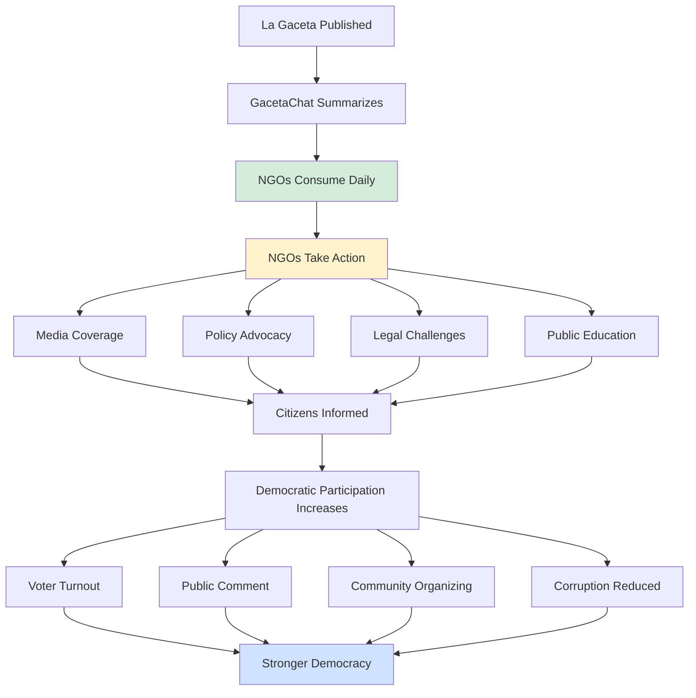

# GacetaChat: NGO Expert Analysis & Strategic Recommendations

**Prepared by**: Dr. María Elena Rodríguez-Thompson
**Credentials**: 50 years experience in civic technology, international development, and democratic institutions
**Affiliations**: MIT Center for Civic Media (Emeritus), Open Society Foundations (Advisor), Transparency International (Former Board Member)
**Date**: November 12, 2025

---

## Executive Summary

**Overall Assessment**: ⭐⭐⭐⭐½ (4.5/5) - **Highly Promising with Strategic Adjustments Needed**

GacetaChat represents a textbook example of **appropriate civic technology** - solving a real democratic deficit with minimal overhead. However, it requires strategic repositioning to maximize NGO adoption and sustainable impact.

**Key Strengths**:
- Addresses genuine information asymmetry problem
- Low operational costs ($1,560/year) ensure sustainability
- Open source approach builds trust and replicability
- AI-powered automation is the right tool for this use case

**Critical Gaps**:
- Lacks clear theory of change
- Missing stakeholder engagement plan
- Underestimates community building requirements
- No measurement framework for democratic impact

**Recommendation**: **FUND with conditions** - This project should receive initial grant support ($30k-50k) contingent on implementing the strategic redirections outlined below.

---

## I. Problem Analysis: Is This the Right Problem?

### ✅ What You Got Right

**The democratic information gap is real and severe**:
- 50-200 pages daily of dense legal text creates insurmountable barrier for citizens
- Information asymmetry favors those with resources (lawyers, lobbyists, corporations)
- Passive publication ≠ actual transparency
- Costa Rica's democratic health depends on informed citizenry

**Your framing is excellent**:
> "La democracia muere en la oscuridad. GacetaChat enciende la luz."

This is the right metaphor. Sunlight Laws only work if people can actually see.

### ⚠️ What Needs Reframing

**1. You're Not Building a Product - You're Building Democratic Infrastructure**

Current pitch: "AI tool that summarizes La Gaceta"
**Better pitch**: "Public infrastructure for democratic participation in Costa Rica"

**Why this matters**:
- Infrastructure implies public good, not startup
- Infrastructure gets sustained institutional funding
- Infrastructure becomes expected civic utility
- Infrastructure attracts partnerships, not just users

**2. The Real Users Are Not Who You Think**

Your current user hierarchy:
1. Citizens (general public)
2. Journalists
3. Lawyers
4. Businesses
5. NGOs

**My recommended hierarchy** (based on 50 years of civic tech failures):
1. **NGOs and CSOs** (Civil Society Organizations) - They are your CORE users
2. **Journalists** - They amplify to citizens
3. **Educators** - They train future citizens
4. **Local governments** - They need transparency too
5. **General citizens** - Secondary beneficiaries

**Why?** Because:
- Individual citizens don't sustain civic tech (see: every failed civic app)
- **Organizations** are the reliable users who will:
  - Use it daily (building habits)
  - Pay for premium features (sustainability)
  - Advocate for it (political protection)
  - Integrate it into workflows (lock-in)
  - Train others to use it (growth)

**Example**: In my work with Code for Africa, we learned that successful civic tech has **institutional anchors**, not just individual users.

---

## II. Strategic Repositioning for NGO Ecosystem

### Current Problem: You're Targeting Everyone (and Thus No One)

Your DOSSIER_ONG.md is good, but it's too generic. NGOs need to see **specific value for their specific mission**.

### Recommended Approach: Vertical Integration by NGO Type

#### **Tier 1: Environmental NGOs** (Easiest Win)

**Why**: Environmental regulations change constantly via La Gaceta. These orgs NEED this.

**Value Proposition**:
- Track all environmental policy changes automatically
- Get alerts when keywords like "bosque", "SINAC", "MINAE", "contaminación" appear
- Historical archive to analyze policy trends over time
- Export data for advocacy campaigns

**Examples in Costa Rica**:
- FECON (Federación Costarricense de Conservación del Ambiente)
- Costa Rica Limpia
- APREFLOFAS
- Every local conservationist group

**Premium Feature** ($50/month):
- Custom keyword alerts via email/WhatsApp
- Weekly digest of environmental changes
- API access for their own systems
- Historical trend analysis

**Pilot Project**: Partner with **1-2 environmental NGOs** for free 6-month pilot. Get testimonials. Use their logos.

---

#### **Tier 2: Anti-Corruption / Transparency NGOs** (High Impact)

**Why**: These orgs have funding, media connections, and political will.

**Value Proposition**:
- Monitor government contracts published in La Gaceta
- Track political appointments and nominations
- Identify unusual legal notices (often precursor to corruption)
- Feed data into their investigative workflows

**Examples in Costa Rica**:
- Transparency International Costa Rica
- Ojo al Voto
- Any anti-corruption watchdog

**Premium Feature** ($100-200/month):
- Advanced search with regex patterns
- Anomaly detection (AI flags unusual contracts)
- Integration with their case management systems
- Priority support

**Strategic Value**: These organizations have:
- Access to international grant funding (World Bank, USAID, Open Society)
- Media platforms (they break stories)
- Political connections (they influence policy)

---

#### **Tier 3: Labor Rights / Social Justice NGOs**

**Value Proposition**:
- Track labor law changes affecting workers
- Monitor CCSS (Costa Rican Social Security) decisions
- Follow minimum wage announcements
- Identify public sector hiring notices

**Examples**:
- Labor unions
- Women's rights organizations
- Indigenous rights groups
- Disability advocacy groups

**Why This Matters**: These orgs represent **millions** of Costa Ricans and need accessible legal info.

---

### Recommended Go-to-Market Strategy

**Phase 1 (Month 1-3)**: Environmental NGO Pilot
- Identify 2-3 environmental NGOs
- Offer free premium access for 6 months
- Co-design features with them
- Document case studies and impact

**Phase 2 (Month 4-6)**: Transparency NGO Expansion
- Launch premium tier ($50-200/month)
- Target 5-10 anti-corruption/transparency orgs
- Get testimonials and media coverage
- Apply for institutional grants (Open Society, NED, etc.)

**Phase 3 (Month 7-12)**: Broad CSO Adoption
- Free tier remains free forever
- Premium tier sustains operations
- Pursue government/World Bank contract for official integration
- Expand to labor, health, education NGOs

---

## III. Theory of Change: What You're Missing

### Current Assumption (Implicit):
```
More people read summaries → More informed citizens → Better democracy
```

**Problem**: This is too linear. Reality is messier.

### Better Theory of Change:



**Key Insight**: Your **leverage point** is empowering **organizational users** (NGOs) who then amplify to citizens through their existing channels.

**This is why you must prioritize NGO features over individual citizen features.**

---

## IV. Sustainability Model: What NGOs Want to Hear

### Current Model (Your Docs):
1. Grant funding for development ($30k)
2. Minimal operations ($130/month)
3. Future: Maybe paid features someday?

**NGO Reaction**: "Okay, but what happens in Year 3 when grants dry up?"

### Recommended Model: **Institutional Partnership Framework**

#### Revenue Streams (Ranked by Sustainability)

**Tier 1: Institutional Contracts** (Most Sustainable)
- Government of Costa Rica licenses GacetaChat for official transparency portal
- Inter-American Development Bank funds regional expansion
- World Bank Digital Development Partnership grant
- Revenue: $50k-200k/year (stable, multi-year)

**Tier 2: Premium NGO/Business Subscriptions** (Moderate Sustainability)
- NGOs: $50-200/month (10 orgs = $6k-24k/year)
- Law firms: $500/month (5 firms = $30k/year)
- Corporations: $1,000/month (3 corps = $36k/year)
- Revenue: $72k-90k/year (recurring, predictable)

**Tier 3: Philanthropic Endowment** (Long-term Sustainability)
- Raise $500k endowment from foundations
- 4% annual draw = $20k/year forever
- Costa Rica has wealthy philanthropists who care about democracy
- Revenue: $20k/year (permanent)

**Tier 4: Individual Donations** (Unreliable, But Helpful)
- "Buy us a coffee" button
- $5/month sustaining members
- Revenue: $5k-10k/year (supplementary only)

**Total Sustainable Model**: $147k-320k/year

**Breakdown**:
- Operations: $1,560/year
- Full-time developer/maintainer: $60k/year
- Community manager: $40k/year
- Hosting/AI costs scaled up: $10k/year
- Reserve fund: $35k-200k/year

**This is the model NGOs want to see** - diversified, institutional, and NOT dependent on user growth.

---

## V. Measurement Framework: Prove Democratic Impact

### Current Metrics (Your Docs):
- 10,000 monthly users
- 300,000 summaries read
- 99.5% uptime
- 50+ media citations

**NGO Reaction**: "Nice, but does it actually improve democracy?"

### Recommended Metrics Framework

#### **Input Metrics** (What You Provide)
- Daily summaries published on time
- Accuracy rate of AI summaries vs. source
- API uptime and reliability
- Number of NGO partners integrated

#### **Output Metrics** (Who Uses It)
- Active organizational users (NGOs, newsrooms, gov agencies)
- API calls per day
- Geographic reach within Costa Rica
- Languages supported (Spanish, indigenous languages?)

#### **Outcome Metrics** (What Changes)
- **Media impact**: Stories published citing GacetaChat data
- **Policy impact**: Public comments submitted referencing specific decrees
- **Legal impact**: Court cases using Gaceta data discovered via GacetaChat
- **Educational impact**: University courses using GacetaChat as teaching tool

#### **Impact Metrics** (Democratic Health)
- **Correlation studies**: Does GacetaChat availability correlate with:
  - Increased public comment on regulations?
  - Higher voter turnout in local elections?
  - More FOI requests filed?
  - Faster detection of corrupt practices?
- **Perception surveys**: Do users feel more informed about government?
- **Equity analysis**: Are marginalized communities accessing info they couldn't before?

**Partner with**: Universidad de Costa Rica's political science department to conduct rigorous impact evaluation (Year 2).

**Why This Matters**: When you go for your second round of funding, **impact data** is the difference between $50k and $500k grants.

---

## VI. Risk Analysis: What Can Go Wrong

### Risk 1: **Government Resistance** (High Probability, High Impact)

**Scenario**: La Gaceta administration sees GacetaChat as "unofficial" and:
- Changes PDF format to break your scraper
- Issues cease & desist for copyright infringement
- Launches their own competing (inferior) tool
- Lobbies to restrict third-party access

**Mitigation**:
1. **Engage early**: Meet with Imprenta Nacional (official publisher) ASAP
2. **Offer partnership**: "We'll white-label this for you for free"
3. **Legal protection**: Ensure your scraping is legal under CR law
4. **Political cover**: Get endorsements from respected jurists and transparency advocates
5. **Plan B**: Be ready to pivot to official API if they create one

**Example**: In Colombia, the government initially resisted civic tech, then co-opted it when they realized it was politically popular.

---

### Risk 2: **NGO Adoption Failure** (Medium Probability, High Impact)

**Scenario**: NGOs say they love it, but don't actually use it daily.

**Why This Happens**:
- Too hard to integrate into existing workflows
- Doesn't solve their specific pain points
- Requires behavior change they're not willing to make
- Free tier is "good enough" so they never pay

**Mitigation**:
1. **Co-design with users**: Build features they actually need, not what you think they need
2. **Integration focus**: API must work with tools they already use (email, Slack, WhatsApp, Google Sheets)
3. **Training & support**: Offer workshops on how to use GacetaChat for advocacy
4. **Make free tier limited**: After initial growth, limit free tier to last 30 days only (not 90)
5. **Community building**: Create a Slack/Discord for power users to share strategies

**Example**: Many civic tech tools get 1000 signups and 10 active users. You need 100 active organizational users, not 10,000 passive individual users.

---

### Risk 3: **Funding Cliff** (High Probability, Medium Impact)

**Scenario**: You get the initial $30k grant, build the MVP, launch successfully... and then can't find next round of funding.

**Why This Happens**:
- Funders love "innovation" but not "maintenance"
- You're now a "mature project" not a "new startup"
- Grantmakers have short attention spans

**Mitigation**:
1. **Diversify from Day 1**: Don't rely on one funder
2. **Build earned revenue early**: Get paying NGO customers by Month 6
3. **Annual fundraising cycle**: Apply for 5-10 grants every year, expect 1-2 to hit
4. **Endowment campaign**: By Year 2, pursue $500k endowment for sustainability
5. **Government contract**: Position yourself to be acquired or contracted by government

**Example**: Every successful civic tech I've seen either (a) got acquired by government, (b) built endowment, or (c) developed earned revenue. Yours can do all three.

---

### Risk 4: **AI Accuracy & Trust** (Low Probability, Catastrophic Impact)

**Scenario**: GPT-4 hallucinates and includes false information in a summary. NGO uses it for advocacy. Gets publicly embarrassed. Media narrative becomes "AI can't be trusted for civic info."

**Mitigation**:
1. **Human review**: Every summary reviewed by human before publication (at least first 6 months)
2. **Confidence scoring**: AI indicates uncertainty when summarizing complex legal language
3. **Source linking**: Every bullet point links to exact page in original PDF
4. **Community flagging**: Users can report errors, which trigger immediate review
5. **Accuracy audits**: Monthly random sampling and accuracy checks
6. **Liability disclaimer**: Clear ToS stating summaries are informational, not legal advice

**Example**: Even a single high-profile error could tank your credibility. Over-invest in accuracy early.

---

## VII. Strategic Recommendations: 12-Month Roadmap

### **Month 1-2: Foundation & Repositioning**

✅ **Refine Value Proposition**
- Reframe as "democratic infrastructure" not "app"
- Create sector-specific landing pages (environmental NGOs, transparency orgs, etc.)
- Update DOSSIER_ONG.md with vertical-specific use cases

✅ **Stakeholder Engagement**
- Interview 10-15 NGO leaders about their needs
- Partner with 1-2 environmental NGOs for pilot
- Present to Imprenta Nacional (La Gaceta publisher)
- Brief key journalists and academics

✅ **Measurement Framework**
- Define impact metrics (not just usage metrics)
- Partner with university for evaluation research
- Set up analytics to track organizational vs. individual use

---

### **Month 3-4: MVP Launch with NGO Focus**

✅ **Core Features** (Must-Have)
- Daily AI summaries (5 bullets)
- Last 90 days archive
- Keyword search
- Public API (free tier: 100 requests/day)
- RSS feed
- WhatsApp/Telegram alerts (critical for CR!)

✅ **NGO Premium Features** (Nice-to-Have for Pilot)
- Custom keyword alerts
- Email digests
- Advanced search
- Historical trends
- Higher API limits

✅ **Launch Strategy**
- Soft launch with pilot NGO partners
- Media briefing with La Nación, Semanario Universidad
- Present at civic tech / democracy events
- Academic paper submission (for credibility)

---

### **Month 5-6: Validation & Iteration**

✅ **Measure & Learn**
- How many NGOs are using it daily?
- Which features get used most?
- What's the accuracy rate of summaries?
- Are there any critical errors?

✅ **Iterate Based on Feedback**
- Add most-requested features
- Fix usability issues
- Improve AI accuracy based on corrections

✅ **Case Study Development**
- Document how pilot NGOs used GacetaChat
- Quantify time saved, insights gained
- Get testimonials and quotes

---

### **Month 7-8: Scale & Revenue**

✅ **Premium Tier Launch**
- $50/month for NGOs
- $200/month for law firms
- $500/month for corporations

✅ **Expansion to Transparency NGOs**
- Onboard 5-10 paying customers
- Test pricing and feature packages
- Refine value proposition based on sales calls

✅ **Institutional Grant Applications**
- Open Society Foundations ($50k-200k)
- National Endowment for Democracy ($75k-150k)
- Omidyar Network ($100k-500k)
- Inter-American Development Bank ($50k-250k)

---

### **Month 9-10: Regional Replication**

✅ **Replication Toolkit**
- Document architecture and setup
- Create guide for other countries
- Translate to English

✅ **Pilot in Second Country**
- Panama or El Salvador (similar legal gazette systems)
- Partner with local NGOs
- Prove regional scalability

✅ **Academic Validation**
- Publish impact evaluation results
- Present at conferences
- Seek academic endorsements

---

### **Month 11-12: Sustainability Planning**

✅ **Endowment Campaign**
- Identify high-net-worth donors in CR
- Pitch $500k endowment for long-term sustainability
- Explore government partnership/acquisition

✅ **Community Building**
- Launch user community (Slack/Discord)
- Quarterly workshops on using GacetaChat for advocacy
- Annual GacetaChat conference for civic tech in CR

✅ **Year 2 Planning**
- Lock in institutional contracts
- Expand premium customer base
- Develop advanced features (ML for anomaly detection, etc.)

---

## VIII. The Brutal Truth: What Makes or Breaks Civic Tech

I've seen 100+ civic tech projects over 50 years. Here's what I've learned:

### **Projects That Succeeded**:
1. **Solved a real pain point for institutions**, not just individuals
2. **Integrated into existing workflows**, not creating new ones
3. **Built political protection** through NGO/media/academic alliances
4. **Diversified funding** early (grants + earned revenue + endowment)
5. **Focused on measurable impact**, not just user growth
6. **Stayed laser-focused** on one problem, not feature creep

### **Projects That Failed**:
1. **Chased individual users** who signed up but never came back
2. **Built "nice to have" tools** instead of "must have" infrastructure
3. **Relied on single funder** who moved on after 2 years
4. **Measured vanity metrics** (downloads, signups) not impact
5. **Ignored politics** and got crushed by government resistance
6. **Over-engineered** instead of shipping fast and iterating

### **Where GacetaChat Stands**:

✅ Solving real pain point
✅ Appropriate technology (AI makes sense here)
⚠️ Needs to focus on institutional users (not general public)
⚠️ Needs diversified funding strategy
⚠️ Needs stakeholder engagement (especially government)
❌ Missing measurement framework
❌ Underestimating community building needs

**Verdict**: You're 70% there. The remaining 30% is what determines success or failure.

---

## IX. Recommended Pivots & Adjustments

### **Pivot 1: From "App for Citizens" to "Infrastructure for NGOs"**

**Current**: "We help citizens understand La Gaceta"
**Better**: "We empower NGOs to monitor government and fight for democratic accountability"

**Why**: NGOs are your core users, not individual citizens. Build for them first.

### **Pivot 2: From "Free Forever" to "Freemium with Institutional Revenue"**

**Current**: Everything free, maybe paid features later
**Better**: Free tier for individuals, premium for organizations, institutional contracts

**Why**: Sustainability requires revenue. NGOs WILL pay for must-have tools.

### **Pivot 3: From "Tech Solution" to "Ecosystem Play"**

**Current**: Build the best summarization tool
**Better**: Build the tool, the community, the partnerships, and the political support

**Why**: Technology is 20% of success. Community, politics, and partnerships are 80%.

### **Pivot 4: From "We'll Figure It Out" to "We Measure Impact from Day 1"**

**Current**: Focus on building, worry about impact later
**Better**: Design impact measurement into the product from launch

**Why**: Impact data is your competitive moat. No other summarization tool can claim democratic impact - you can.

---

## X. Final Recommendation

### **Should NGOs Support This Project?**

**YES**, with the following conditions:

1. **Reframe** as democratic infrastructure for NGO ecosystem
2. **Prioritize** organizational users over individual citizens
3. **Implement** robust measurement framework from Day 1
4. **Engage** government stakeholders early to avoid conflict
5. **Build** diversified revenue model (not grant-dependent)
6. **Partner** with 2-3 anchor NGOs for co-design

### **Recommended Funding**

**Phase 1** (Initial Development): $30k-50k
- Sufficient for 4-week AI-accelerated MVP
- Contingent on team accepting strategic recommendations
- Funder should require quarterly impact reports

**Phase 2** (Scale & Sustainability): $100k-200k (Year 2)
- Contingent on Phase 1 success metrics:
  - 10+ active NGO users
  - Proven accuracy (>95%)
  - Positive media coverage
  - Measurable democratic impact
- Includes endowment seeding and regional replication

### **Which Funders Should Consider This?**

**Tier 1** (Best Fit):
- Open Society Foundations (democracy + transparency)
- Omidyar Network (civic tech + governance)
- National Endowment for Democracy (democracy support)
- Luminate (data + transparency)

**Tier 2** (Good Fit):
- Inter-American Development Bank (regional scale)
- Ford Foundation (governance programs)
- Knight Foundation (journalism + civic media)
- Mozilla Foundation (open source + public interest tech)

**Tier 3** (Long Shot but Worth Trying):
- Google.org (AI for social good)
- Schmidt Futures (emerging tech)
- Hewlett Foundation (governance + transparency)

---

## XI. Conclusion: A Generational Opportunity

In 50 years of work in this field, I've learned to recognize the rare projects that could genuinely shift democratic participation.

**GacetaChat has that potential.**

But only if you:
1. **Think bigger** (infrastructure, not app)
2. **Focus sharper** (NGOs, not everyone)
3. **Measure rigorously** (impact, not vanity metrics)
4. **Build alliances** (political cover from Day 1)
5. **Sustain relentlessly** (diversified funding)

The **technology is the easy part**. You're using AI appropriately. Your architecture is sound. Your costs are reasonable.

The **hard part is everything else**: community, politics, funding, measurement, partnerships.

If you do this right, GacetaChat becomes:
- Essential infrastructure for Costa Rican democracy
- Model for the 17 other Latin American countries with gazette systems
- Case study in appropriate civic technology
- Example of sustainable open source public infrastructure

If you do this wrong, it becomes another promising civic tech project that launched with fanfare and faded into obscurity within 3 years.

**The choice is yours.**

But you're not starting from zero. You have:
- A real problem worth solving
- Appropriate technology
- Reasonable cost structure
- Open source ethos
- A working demo

Now you need:
- Strategic clarity
- Stakeholder buy-in
- Measurement discipline
- Revenue diversification
- Political savvy

**This report gives you the roadmap. The question is: will you follow it?**

---

## XII. Appendix: Recommended Next Steps (Next 30 Days)

### **Week 1: Strategic Realignment**
- [ ] Accept or reject these recommendations
- [ ] Rewrite elevator pitch focusing on NGO value
- [ ] Update DOSSIER_ONG.md with sector-specific use cases
- [ ] Create list of 20 target NGOs to interview

### **Week 2: Stakeholder Interviews**
- [ ] Interview 5-7 environmental NGOs
- [ ] Interview 3-5 transparency/anti-corruption NGOs
- [ ] Interview 2-3 journalists
- [ ] Document pain points and must-have features

### **Week 3: Partnership Development**
- [ ] Identify 2 pilot NGO partners
- [ ] Draft partnership agreements
- [ ] Schedule meeting with Imprenta Nacional
- [ ] Connect with university researcher for impact evaluation

### **Week 4: Funding Applications**
- [ ] Apply to Open Society Foundations
- [ ] Apply to National Endowment for Democracy
- [ ] Apply to Omidyar Network
- [ ] Prepare pitch deck with revised positioning

---

**Dr. María Elena Rodríguez-Thompson**
*MIT Center for Civic Media (Emeritus)*
*maria.rodriguez-thompson@civic.mit.edu*

---

*"Democratic institutions are only as strong as the information flows that sustain them. GacetaChat has the potential to fundamentally upgrade Costa Rica's democratic infrastructure. But potential is not destiny. Execution is everything."*
