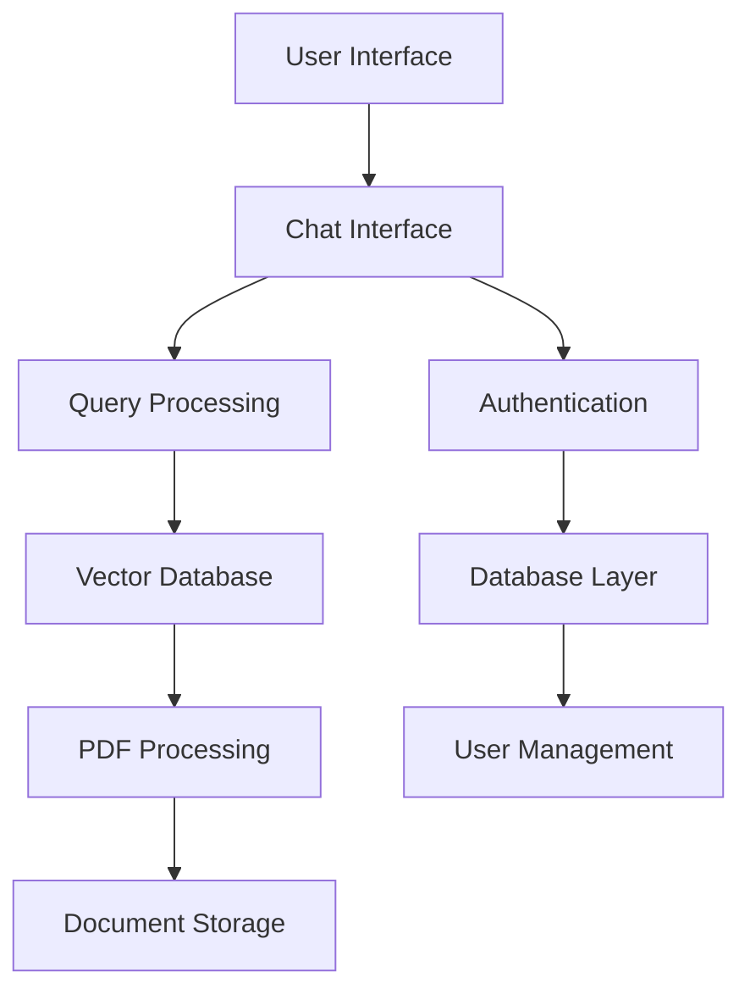

# System Components

This document provides detailed information about the individual components that make up the GacetaChat platform.

## Core Components

### 1. PDF Processing Engine
- **Location**: `pdf_processor.py`
- **Purpose**: Handles PDF download, processing, and text extraction
- **Key Features**:
  - Automated PDF download from government sources
  - Text extraction and chunking
  - Metadata preservation
  - Error handling and retry mechanisms

### 2. Vector Database (FAISS)
- **Location**: `faiss_helper.py`
- **Purpose**: Manages vector storage and similarity search
- **Key Features**:
  - Document embeddings generation
  - Efficient similarity search
  - Index management and persistence
  - Batch processing capabilities

### 3. Chat Interface
- **Location**: `streamlit_app.py`, `app.py`
- **Purpose**: Provides user interface for document queries
- **Key Features**:
  - Natural language query processing
  - Multi-turn conversations
  - Response formatting
  - User session management

### 4. Authentication System
- **Location**: `oauth_helpers.py`
- **Purpose**: Handles user authentication and authorization
- **Key Features**:
  - OAuth integration
  - Session management
  - User permissions
  - Security token handling

### 5. Database Layer
- **Location**: `db.py`, `models.py`, `crud.py`
- **Purpose**: Manages persistent data storage
- **Key Features**:
  - SQLite database management
  - ORM models
  - CRUD operations
  - Data migrations

## Component Interactions

## Data Flow

1. **Document Ingestion**:
   - PDF files are downloaded and processed
   - Text is extracted and chunked
   - Embeddings are generated and stored in FAISS

2. **Query Processing**:
   - User queries are processed through the chat interface
   - Vector similarity search is performed
   - Relevant document chunks are retrieved

3. **Response Generation**:
   - Retrieved context is used to generate responses
   - Responses are formatted and returned to the user

## Configuration

Each component can be configured through:
- Environment variables
- Configuration files (`config.py`)
- Runtime parameters

## Error Handling

Components implement comprehensive error handling:
- Logging at multiple levels
- Graceful degradation
- Retry mechanisms
- User-friendly error messages

## Performance Considerations

- **Caching**: Frequently accessed data is cached
- **Batch Processing**: Large operations are batched
- **Memory Management**: Efficient memory usage patterns
- **Connection Pooling**: Database connections are pooled

## Security

- **Input Validation**: All user inputs are validated
- **Authentication**: Secure user authentication
- **Authorization**: Role-based access control
- **Data Protection**: Sensitive data is encrypted

## Monitoring

Each component includes:
- Performance metrics
- Health checks
- Error tracking
- Usage analytics

## Future Enhancements

Planned improvements for each component:
- Scalability improvements
- Performance optimizations
- Additional features
- Security enhancements
