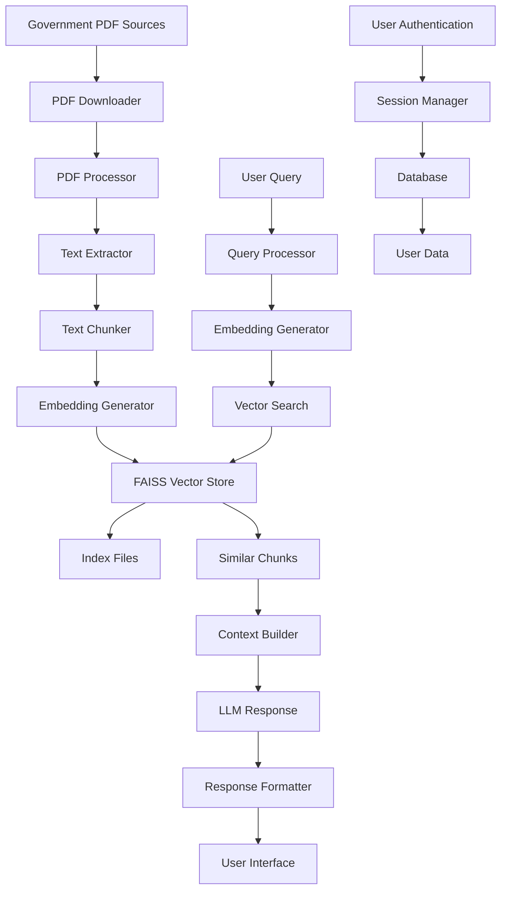

# Data Flow Architecture

This document describes how data flows through the GacetaChat system, from initial document ingestion to user query responses.

## Overview

The GacetaChat platform processes data through several stages:
1. **Document Acquisition** - Downloading PDFs from government sources
2. **Processing Pipeline** - Text extraction, chunking, and embedding
3. **Storage Layer** - Persistent storage of processed data
4. **Query Processing** - Real-time user query handling
5. **Response Generation** - Context-aware answer generation

## Data Flow Diagram



## Stage 1: Document Acquisition

### Input Sources
- **Primary**: Costa Rica's official gazette (La Gaceta)
- **Format**: PDF documents
- **Frequency**: Daily downloads
- **Storage**: Local file system (`gaceta_pdfs/`)

### Process Flow
1. **Scheduled Download**: Automated daily downloads
2. **File Validation**: PDF integrity checks
3. **Metadata Extraction**: Date, edition, size information
4. **Storage Organization**: Date-based folder structure

```python
# Example structure
gaceta_pdfs/
├── 2024-07-15/
│   ├── gaceta.pdf
│   ├── index.faiss
│   └── index.pkl
└── 2024-07-16/
    ├── gaceta.pdf
    ├── index.faiss
    └── index.pkl
```

## Stage 2: Processing Pipeline

### Text Extraction
- **Tool**: PyPDF2 or similar libraries
- **Output**: Raw text content
- **Challenges**: OCR for scanned documents, formatting preservation

### Text Chunking
- **Strategy**: Semantic chunking with overlap
- **Chunk Size**: 1000 characters (configurable)
- **Overlap**: 200 characters
- **Metadata**: Page numbers, section headers

### Embedding Generation
- **Model**: OpenAI embeddings or similar
- **Dimensions**: 1536 (OpenAI ada-002)
- **Batch Size**: 100 chunks per batch
- **Caching**: Embeddings cached for reuse

## Stage 3: Storage Layer

### Vector Storage (FAISS)
- **Index Type**: HNSW (Hierarchical Navigable Small World)
- **Persistence**: Binary files (.faiss, .pkl)
- **Metadata**: Stored separately with chunk information

### Database Storage
- **Type**: SQLite
- **Tables**: Documents, chunks, users, sessions
- **Relationships**: Foreign key constraints
- **Backup**: Regular automated backups

## Stage 4: Query Processing

### User Query Flow
1. **Input Reception**: User submits query via interface
2. **Authentication**: User session validation
3. **Query Preprocessing**: Cleaning and normalization
4. **Embedding Generation**: Convert query to vector
5. **Similarity Search**: Find relevant document chunks
6. **Context Building**: Combine relevant chunks
7. **Response Generation**: Generate answer using LLM

### Vector Search Process
```python
# Simplified search flow
def search_documents(query, k=5):
    # Convert query to embedding
    query_embedding = generate_embedding(query)
    
    # Search FAISS index
    distances, indices = faiss_index.search(query_embedding, k)
    
    # Retrieve document chunks
    relevant_chunks = get_chunks_by_indices(indices)
    
    return relevant_chunks
```

## Stage 5: Response Generation

### Context Assembly
- **Selection**: Top-k relevant chunks
- **Ranking**: Relevance score-based ordering
- **Filtering**: Duplicate removal
- **Limitation**: Token count constraints

### LLM Integration
- **Model**: GPT-3.5/4 or similar
- **Prompt Engineering**: Context + query + instructions
- **Response Formatting**: Structured output
- **Error Handling**: Graceful failures

## Data Persistence

### File System
- **PDFs**: Original documents preserved
- **Indexes**: FAISS binary files
- **Logs**: Processing and error logs
- **Configuration**: Settings and parameters

### Database
- **Schema**: Relational data model
- **Transactions**: ACID compliance
- **Indexing**: Query performance optimization
- **Migrations**: Version control for schema changes

## Performance Considerations

### Bottlenecks
- **PDF Processing**: CPU-intensive text extraction
- **Embedding Generation**: API rate limits
- **Vector Search**: Memory usage with large indexes
- **Storage I/O**: Disk access patterns

### Optimization Strategies
- **Caching**: Multi-level caching strategy
- **Batch Processing**: Reduce API calls
- **Parallel Processing**: Multi-threading for I/O
- **Memory Management**: Efficient data structures

## Error Handling

### Common Errors
- **PDF Corruption**: Unreadable files
- **Network Issues**: Download failures
- **API Limits**: Rate limiting
- **Storage Full**: Disk space issues

### Recovery Mechanisms
- **Retry Logic**: Exponential backoff
- **Fallback Options**: Alternative processing methods
- **Error Logging**: Comprehensive error tracking
- **User Notifications**: Graceful error messages

## Monitoring and Observability

### Metrics
- **Processing Time**: Per-document processing duration
- **Storage Usage**: Disk and memory consumption
- **Query Performance**: Response time distribution
- **Error Rates**: Failure percentages

### Logging
- **Levels**: DEBUG, INFO, WARNING, ERROR
- **Structured**: JSON-formatted logs
- **Rotation**: Automatic log file management
- **Centralized**: Aggregated logging system

## Security Considerations

### Data Protection
- **Encryption**: Sensitive data encryption
- **Access Control**: Role-based permissions
- **Audit Logging**: Access and modification tracking
- **Backup Security**: Encrypted backups

### Privacy
- **User Data**: Minimal collection
- **Session Management**: Secure session handling
- **Data Retention**: Automatic cleanup policies
- **Compliance**: GDPR/privacy regulation adherence

## Scalability Patterns

### Horizontal Scaling
- **Microservices**: Component separation
- **Load Balancing**: Request distribution
- **Database Sharding**: Data partitioning
- **Caching Layers**: Distributed caching

### Vertical Scaling
- **Resource Optimization**: Memory and CPU tuning
- **Database Optimization**: Query and index tuning
- **Storage Optimization**: Compression and archiving
- **Network Optimization**: Connection pooling

## Future Enhancements

### Planned Improvements
- **Real-time Processing**: Stream processing capabilities
- **Multi-language Support**: Internationalization
- **Advanced Analytics**: Usage and performance analytics
- **Integration APIs**: Third-party integrations
- **Mobile Support**: Mobile-optimized interfaces
