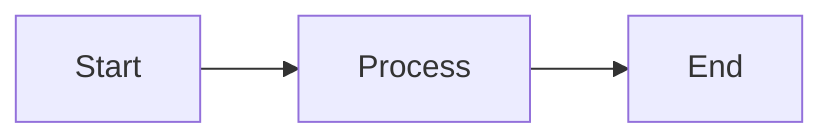

# MkDocs Commands and Setup

This document explains how to work with the MkDocs documentation system for GacetaChat.

## 📚 MkDocs Overview

GacetaChat uses MkDocs with the Material theme to create beautiful, searchable documentation. The docs are organized in a logical structure with navigation, search, and responsive design.

## 🚀 Quick Start

### Install MkDocs

```bash
# Install documentation dependencies
pip install -r requirements-docs.txt

# Or install individually
pip install mkdocs mkdocs-material
```

### Serve Documentation Locally

```bash
# Start development server
mkdocs serve

# Access documentation at:
# http://127.0.0.1:8000
```

### Build Static Site

```bash
# Build static documentation
mkdocs build

# Output will be in 'site/' directory
```

## 🔧 Development Workflow

### Live Editing

When you run `mkdocs serve`, changes to markdown files are automatically reflected in the browser. Perfect for writing and editing documentation.

### Project Structure

```
docs/
├── index.md                 # Homepage
├── getting-started/
│   ├── installation.md
│   ├── quick-start.md
│   └── configuration.md
├── architecture/
│   └── system-overview.md
├── development/
│   └── standards.md
├── business/
│   └── market-analysis.md
├── operations/
│   └── pain-points.md
├── guides/
│   └── demo-guide.md
├── reference/
│   └── lessons-learned.md
├── stylesheets/
│   └── extra.css
└── javascripts/
    └── mathjax.js
```

### Adding New Pages

1. Create markdown file in appropriate directory
2. Add to navigation in `mkdocs.yml`
3. Use proper markdown formatting

### Markdown Features

The documentation supports advanced markdown features:

#### Code Blocks with Syntax Highlighting

```python
def example_function():
    """Example with syntax highlighting."""
    return "Hello, World!"
```

#### Admonitions

!!! info "Information"
    This is an info admonition.

!!! warning "Warning"
    This is a warning admonition.

!!! tip "Pro Tip"
    This is a tip admonition.

#### Mermaid Diagrams



#### Tables

| Feature | Status | Priority |
|---------|--------|----------|
| Search | ✅ Ready | High |
| Navigation | ✅ Ready | High |
| Mobile | ✅ Ready | Medium |

## 🎨 Customization

### Theme Configuration

The Material theme is configured in `mkdocs.yml`:

```yaml
theme:
  name: material
  palette:
    # Light mode
    - scheme: default
      primary: blue
      accent: pink
      toggle:
        icon: material/brightness-7
        name: Switch to dark mode
    # Dark mode  
    - scheme: slate
      primary: blue
      accent: pink
      toggle:
        icon: material/brightness-4
        name: Switch to light mode
```

### Custom CSS

Additional styling is in `docs/stylesheets/extra.css`:

- Custom color variables
- Enhanced code blocks
- Responsive design
- Print styles

### Custom JavaScript

Mathematical notation support in `docs/javascripts/mathjax.js`.

## 📖 Writing Guidelines

### Markdown Best Practices

1. **Use descriptive headings**: Clear hierarchy with #, ##, ###
2. **Add code examples**: Always include working code samples
3. **Include screenshots**: Visual guides help users
4. **Cross-reference**: Link to related documentation
5. **Keep it updated**: Documentation should match current code

### Content Structure

Each page should have:

1. **Clear title** and purpose
2. **Table of contents** for long pages
3. **Prerequisites** if applicable
4. **Step-by-step instructions**
5. **Examples and code samples**
6. **Troubleshooting section**
7. **Next steps or related links**

### Code Documentation

```python
# Good: Clear, commented code examples
def process_document(doc_id: str) -> ProcessingResult:
    """
    Process a document with AI analysis.
    
    Args:
        doc_id: Unique document identifier
        
    Returns:
        ProcessingResult with analysis and metadata
        
    Example:
        >>> result = process_document("2025-07-06")
        >>> print(result.summary)
    """
    # Implementation details...
```

## 🚀 Deployment

### GitHub Pages

```bash
# Build and deploy to GitHub Pages
mkdocs gh-deploy

# This will:
# 1. Build the documentation
# 2. Push to gh-pages branch
# 3. Make it available at username.github.io/repo-name
```

### Custom Domain

1. Add `CNAME` file to `docs/` directory
2. Configure DNS to point to GitHub Pages
3. Enable HTTPS in repository settings

### Automated Deployment

Create GitHub Action for automatic deployment:

```yaml
# .github/workflows/docs.yml
name: Deploy Documentation
on:
  push:
    branches: [ main ]
    paths: [ 'docs/**', 'mkdocs.yml' ]

jobs:
  deploy:
    runs-on: ubuntu-latest
    steps:
    - uses: actions/checkout@v2
    - name: Setup Python
      uses: actions/setup-python@v2
      with:
        python-version: 3.9
    - name: Install dependencies
      run: pip install -r requirements-docs.txt
    - name: Deploy docs
      run: mkdocs gh-deploy --force
```

## 🔍 Search Configuration

### Search Features

- **Full-text search**: Search all documentation content
- **Search highlighting**: Results show matched terms
- **Search suggestions**: Auto-complete suggestions
- **Fast search**: Client-side search for speed

### Search Optimization

- Use descriptive headings
- Include relevant keywords
- Add alt text to images
- Use clear, searchable language

## 📊 Analytics

### Google Analytics

Add to `mkdocs.yml`:

```yaml
extra:
  analytics:
    provider: google
    property: G-XXXXXXXXXX
```

### Custom Analytics

Add tracking code to `docs/javascripts/analytics.js`:

```javascript
// Custom analytics tracking
gtag('config', 'GA_TRACKING_ID', {
  page_title: document.title,
  page_location: window.location.href
});
```

## 🛠️ Maintenance

### Regular Tasks

1. **Update content**: Keep docs current with code changes
2. **Check links**: Verify all links work correctly
3. **Review structure**: Improve navigation and organization
4. **Update dependencies**: Keep MkDocs and plugins updated
5. **Monitor analytics**: Understand how users navigate docs

### Quality Checks

```bash
# Check for broken links
mkdocs build --strict

# Spell check (if available)
vale docs/

# Link checker
markdown-link-check docs/**/*.md
```

## 🤝 Contributing to Documentation

### Process

1. **Fork repository**
2. **Create feature branch**
3. **Make documentation changes**
4. **Test locally** with `mkdocs serve`
5. **Submit pull request**

### Review Checklist

- [ ] Content is accurate and up-to-date
- [ ] Formatting is consistent
- [ ] Links work correctly
- [ ] Code examples are tested
- [ ] Images have alt text
- [ ] Mobile layout works
- [ ] Search finds relevant content

## 📞 Getting Help

For documentation questions:

- 📖 **MkDocs Documentation**: [mkdocs.org](https://www.mkdocs.org/)
- 🎨 **Material Theme**: [squidfunk.github.io/mkdocs-material](https://squidfunk.github.io/mkdocs-material/)
- 💬 **Community**: [Discord](https://discord.gg/gacetachat)
- 🐛 **Issues**: [GitHub Issues](https://github.com/gacetachat/gacetachat/issues)

!!! success "Ready to Document!"
    Your MkDocs setup is complete. Start writing great documentation to help users succeed with GacetaChat!
