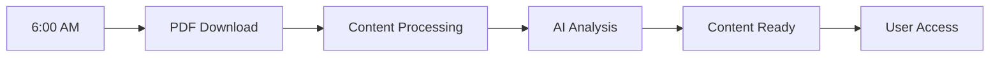

# Quick Start Guide

Get GacetaChat up and running in 5 minutes! This guide assumes you have already completed the [installation](installation.md).

## 🚀 5-Minute Setup

### Step 1: Verify Installation

```bash
# Check if services are running
curl http://localhost:8050/health
curl http://localhost:8512
```

You should see:
- ✅ API health check returns 200 OK
- ✅ Streamlit interface loads at `http://localhost:8512`

### Step 2: First Login

1. Open your browser to `http://localhost:8512`
2. You should see the GacetaChat dashboard
3. Select today's date from the sidebar

!!! tip "No data yet?"
    If no data is available, the background processor may still be downloading today's gazette. This is normal for first-time setup.

### Step 3: Test the Chat Interface

1. Navigate to the **"Chat with Today's PDF"** tab
2. Try these sample queries:

```
¿Cuáles son las noticias principales de hoy?
What are the main announcements today?
Any new business regulations?
```

### Step 4: View Processed Content

1. Go to the **"Today's Processed Prompts"** tab
2. You'll see automated summaries:
   - News highlights
   - Legal changes
   - Economic announcements
   - Social media posts

## 📋 Basic Usage Patterns

### For Legal Professionals

```bash
# Example queries for legal use
"Any new court appointments?"
"What regulations affect corporate law?"
"Are there changes to the legal procedures?"
"New judicial decisions announced?"
```

### For Journalists

```bash
# Example queries for news gathering
"What are the top 3 news stories today?"
"Any controversial government decisions?"
"New economic policies announced?"
"Political appointments or changes?"
```

### For Business Users

```bash
# Example queries for business intelligence
"New business registration requirements?"
"Tax law changes affecting companies?"
"Government contract opportunities?"
"Import/export regulation updates?"
```

## 🎯 Core Features Overview

### 1. **Automated Processing**

Every day, GacetaChat automatically:

- ✅ Downloads the latest official gazette PDF
- ✅ Processes and indexes the content
- ✅ Generates summaries and analyses
- ✅ Creates social media content

### 2. **Interactive Chat**

Ask questions in natural language:

```
User: "¿Hay nuevas regulaciones para empresas de tecnología?"
GacetaChat: "Sí, se anunciaron incentivos fiscales para empresas de 
tecnología que facturen menos de $50K anuales. También se simplificó 
el proceso de registro digital para startups.
Fuente: Gaceta Sección 4.2, Página 15"
```

### 3. **Content Formats**

Choose from multiple content formats:

- **📰 News Summaries**: 3-5 main stories in plain language
- **📱 Social Media**: Twitter-ready posts with emojis
- **📊 Business Digest**: Economic and regulatory updates
- **⚖️ Legal Brief**: Court decisions and legal changes

### 4. **Source Citations**

Every response includes:
- Direct quotes from the source
- Page numbers and section references
- Link to original PDF document

## 🔧 Configuration Basics

### Customizing AI Responses

In the sidebar, adjust:

```python
# Model Selection
- GPT-4o (best quality, higher cost)
- GPT-4o-mini (balanced)
- GPT-3.5-turbo (faster, lower cost)

# Response Settings
- Temperature: 0.1-1.0 (creativity level)
- Max Tokens: 500-2000 (response length)
```

### Setting Up Prompts

Create custom prompt templates:

```python
# Example: Business-focused prompt
prompt = """
Analyze today's gazette and create a summary focusing on:
1. New business regulations
2. Tax changes
3. Import/export rules
4. Government contracts

Use simple language and include specific details.
"""
```

### Language Settings

Switch between languages:
- **Spanish**: Default for Costa Rican content
- **English**: For international users
- **Bilingual**: Mixed responses as needed

## 📊 Understanding the Dashboard

### Main Sections

1. **Home Tab**: Overview and recent activity
2. **Chat Tab**: Interactive Q&A interface  
3. **Admin Tab**: System logs and monitoring
4. **Twitter Tab**: Social media integration

### Status Indicators

- 🟢 **Green**: System healthy, processing normally
- 🟡 **Yellow**: Minor issues, reduced performance
- 🔴 **Red**: System error, manual intervention needed

### Daily Workflow



## 💡 Tips for Better Results

### Query Best Practices

✅ **Good Queries**:
```
"What economic policies were announced today?"
"Any new environmental regulations?"
"Changes to healthcare laws?"
```

❌ **Poor Queries**:
```
"Tell me everything"
"What's in the document?"
"Any news?"
```

### Advanced Features

1. **Date Selection**: Query historical gazettes
2. **Export Options**: Save responses as PDF or text
3. **Comparison Mode**: Compare changes over time
4. **Alert Setup**: Get notified of specific topics

## 🔍 Troubleshooting Quick Fixes

### Common Issues & Solutions

| Issue | Quick Fix |
|-------|-----------|
| **Slow responses** | Switch to GPT-3.5-turbo model |
| **No data for today** | Wait for background processing to complete |
| **Error messages** | Check API key configuration |
| **PDF not found** | Verify internet connection |

### Emergency Procedures

If something goes wrong:

```bash
# Restart all services
pm2 restart all

# Check service status
pm2 status

# View recent logs
pm2 logs --lines 50
```

## 📈 Monitoring Usage

### Daily Limits

- **Basic**: 50 queries per day
- **Professional**: 500 queries per day  
- **Enterprise**: Unlimited

### Performance Metrics

Track your usage:
- Response times
- Query success rate
- Cost per query
- User satisfaction

## 🎓 Learning Resources

### Next Steps

1. **[User Guide](../guides/user-guide.md)**: Detailed feature explanations
2. **[Admin Guide](../guides/admin-guide.md)**: System administration
3. **[API Reference](../development/api-reference.md)**: Developer documentation
4. **[Demo Guide](../guides/demo-guide.md)**: How to showcase the system

### Video Tutorials

- 📹 **Getting Started** (5 min): Basic navigation and queries
- 📹 **Advanced Features** (10 min): Custom prompts and settings
- 📹 **Admin Tasks** (15 min): System maintenance and monitoring

### Community

- 💬 **Discord**: [discord.gg/gacetachat](https://discord.gg/gacetachat)
- 📧 **Email**: support@gacetachat.com
- 🐛 **Issues**: [GitHub Issues](https://github.com/gacetachat/gacetachat/issues)

## ✅ Checklist: You're Ready!

After completing this guide, you should be able to:

- [ ] Access the GacetaChat interface
- [ ] Ask questions about the gazette
- [ ] View processed summaries
- [ ] Understand response sources
- [ ] Adjust basic settings
- [ ] Navigate the dashboard
- [ ] Monitor system status

!!! success "Congratulations!"
    You're now ready to use GacetaChat effectively! For advanced features and customization, explore the detailed guides in the documentation.

## 🎯 What's Next?

Ready to take it further?

1. **Customize for Your Needs**: Set up industry-specific prompts
2. **Integrate with Your Workflow**: Use the API for automation
3. **Scale Your Usage**: Consider upgrading for higher limits
4. **Join the Community**: Share feedback and learn from others

Happy chatting with Costa Rica's gazette! 🇨🇷
