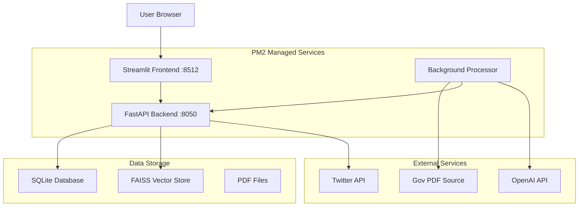

# GacetaChat Documentation

  
  
  
  

!!! info "Welcome to GacetaChat"
    AI-powered chatbot system for automated processing and analysis of Costa Rica's daily official gazette (Gaceta Oficial)

## 🎯 Overview

GacetaChat is a sophisticated AI-powered system that automatically downloads, processes, and analyzes Costa Rica's daily official gazette. It provides intelligent content summarization, social media automation, and interactive query capabilities for legal professionals, journalists, and citizens.

### Key Features

- **🤖 Automated PDF Processing**: Daily download and processing of official gazette PDFs
- **� Semantic Search**: FAISS-powered vector search for accurate information retrieval
- **💬 Interactive Chat**: ChatGPT-powered Q&A with document context
- **🐦 Social Media Integration**: Automated Twitter content generation
- **📊 Multi-format Content**: Newsletter, headlines, economic updates, legal changes
- **🎭 Humorous Summaries**: Engaging 280-character news summaries with emojis
- **📱 Multi-platform**: Web interface with mobile-responsive design
- **🔒 Rate Limiting**: Built-in usage controls and session management

## 🏗️ Architecture

## 📖 Documentation Overview

### 🚀 **Getting Started**
- [**Installation Guide**](getting-started/installation.md) - Setup and configuration
- [**Quick Start**](getting-started/quick-start.md) - Get up and running quickly
- [**Configuration**](getting-started/configuration.md) - Environment and settings

### 🏗️ **Technical Documentation**
- [**System Architecture**](architecture/system-overview.md) - Overall system design
- [**Components**](architecture/components.md) - Individual system components
- [**Development Standards**](development/standards.md) - Coding practices and guidelines
- [**API Reference**](development/api-reference.md) - Complete API documentation

### 💼 **Business Documentation**
- [**Market Analysis**](business/market-analysis.md) - Market opportunity and sizing
- [**Business Models**](business/business-models.md) - Revenue strategies
- [**Go-to-Market Strategy**](business/go-to-market.md) - Launch and scaling plans

### 🔧 **Operations**
- [**Pain Points**](operations/pain-points.md) - Current issues and solutions
- [**Monitoring**](operations/monitoring.md) - System monitoring and alerting
- [**Performance**](operations/performance.md) - Performance optimization

### 📚 **Guides**
- [**Demo Guide**](guides/demo-guide.md) - How to showcase the platform
- [**User Guide**](guides/user-guide.md) - End-user documentation
- [**Admin Guide**](guides/admin-guide.md) - Administrative procedures

## 🎯 Quick Navigation

### For Developers
1. Start with [Development Standards](development/standards.md) for coding standards
2. Review [System Architecture](architecture/system-overview.md) for system design
3. Check [Pain Points](operations/pain-points.md) for known issues

### For Business Stakeholders
1. Begin with [Market Analysis](business/market-analysis.md) for project overview
2. Explore [Business Models](business/business-models.md) for business opportunities
3. Use [Demo Guide](guides/demo-guide.md) for presentations

### For Project Managers
1. Review [Lessons Learned](reference/lessons-learned.md) for project insights
2. Study [Pain Points](operations/pain-points.md) for prioritization
3. Reference [Business Models](business/business-models.md) for roadmap

## 📚 Document Summaries

### README.md
- **Purpose**: Main project documentation
- **Audience**: All stakeholders
- **Key Topics**: Features, installation, usage, architecture overview
- **Last Updated**: Current

### ARCHITECTURE.md
- **Purpose**: Technical system design
- **Audience**: Developers, architects, technical stakeholders
- **Key Topics**: Component architecture, data flow, deployment patterns
- **Last Updated**: Current

### DEVELOPMENT.md
- **Purpose**: Development standards and practices
- **Audience**: Developers, contributors
- **Key Topics**: Code standards, testing, deployment, workflows
- **Last Updated**: Current

### PAIN_POINTS.md
- **Purpose**: Current issues and solutions
- **Audience**: Developers, product managers, stakeholders
- **Key Topics**: Critical issues, performance problems, recommended fixes
- **Last Updated**: Current

### COMMERCIALIZATION.md
- **Purpose**: Business strategy and market opportunities
- **Audience**: Business stakeholders, investors, partners
- **Key Topics**: Market analysis, business models, go-to-market strategy
- **Last Updated**: Current

### LESSONS_LEARNED.md
- **Purpose**: Project insights and best practices
- **Audience**: Developers, project managers, future teams
- **Key Topics**: What worked, what didn't, recommendations
- **Last Updated**: Current

### DEMO_GUIDE.md
- **Purpose**: Demonstration and showcase instructions
- **Audience**: Sales, marketing, business development
- **Key Topics**: Demo scripts, setup, best practices
- **Last Updated**: Current

## 🔄 Documentation Maintenance

### Update Schedule
- **Monthly**: Review and update all documentation
- **Feature Releases**: Update relevant technical documentation
- **Business Milestones**: Update business-focused documentation

### Contribution Guidelines
1. Keep documentation current with code changes
2. Use clear, concise language
3. Include practical examples
4. Update the index when adding new documents
5. Review for accuracy before committing

### Documentation Standards
- **Format**: Markdown (.md) files
- **Structure**: Clear headings and sections
- **Code Examples**: Include working code snippets
- **Links**: Use relative links for internal references
- **Images**: Store in `/docs/images/` if needed

## 🔍 Search & Navigation Tips

### Finding Information
- **Use Ctrl+F** to search within documents
- **Check the index** for quick topic location
- **Follow cross-references** between documents
- **Look for code examples** in technical docs

### Common Questions & Answers

**Q: How do I set up the development environment?**
A: See [DEVELOPMENT.md](./DEVELOPMENT.md) → Development Workflow section

**Q: What are the main technical challenges?**
A: See [PAIN_POINTS.md](./PAIN_POINTS.md) → Critical Issues section

**Q: How can this be commercialized?**
A: See [COMMERCIALIZATION.md](./COMMERCIALIZATION.md) → Business Model Options section

**Q: What lessons were learned from this project?**
A: See [LESSONS_LEARNED.md](./LESSONS_LEARNED.md) → Technical Lessons section

**Q: How do I demo this system?**
A: See [DEMO_GUIDE.md](./DEMO_GUIDE.md) → Demo Script Templates section

## 📊 Documentation Health

### Completeness Checklist
- [x] Project overview and setup
- [x] Technical architecture
- [x] Development standards
- [x] Known issues and solutions
- [x] Business opportunities
- [x] Lessons learned
- [x] Demo and showcase guide
- [x] Documentation index

### Quality Metrics
- **Accuracy**: All information is current and correct
- **Completeness**: All major topics are covered
- **Clarity**: Information is easy to understand
- **Usability**: Easy to navigate and find information

## 🎯 Next Steps

### For New Team Members
1. Read [README.md](../README.md) for project overview
2. Follow [DEVELOPMENT.md](./DEVELOPMENT.md) for environment setup
3. Review [ARCHITECTURE.md](./ARCHITECTURE.md) for system understanding
4. Check [PAIN_POINTS.md](./PAIN_POINTS.md) for current challenges

### For Ongoing Development
1. Keep documentation updated with code changes
2. Add new learnings to [LESSONS_LEARNED.md](./LESSONS_LEARNED.md)
3. Update [PAIN_POINTS.md](./PAIN_POINTS.md) as issues are resolved
4. Refine [COMMERCIALIZATION.md](./COMMERCIALIZATION.md) based on market feedback

## 📞 Support & Contact

For questions about the documentation:
- **Technical Issues**: Check [PAIN_POINTS.md](./PAIN_POINTS.md)
- **Development Questions**: See [DEVELOPMENT.md](./DEVELOPMENT.md)
- **Business Inquiries**: Reference [COMMERCIALIZATION.md](./COMMERCIALIZATION.md)

---

*This documentation index is maintained to provide easy access to all project documentation. Please keep it updated as new documents are added or existing ones are modified.*
